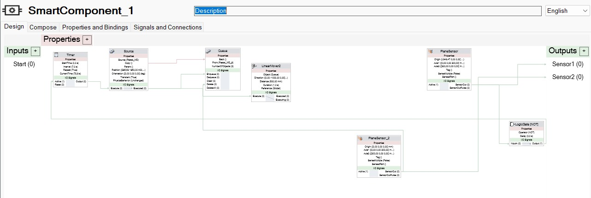
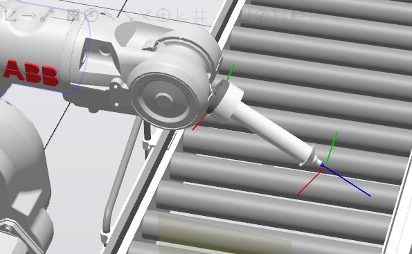
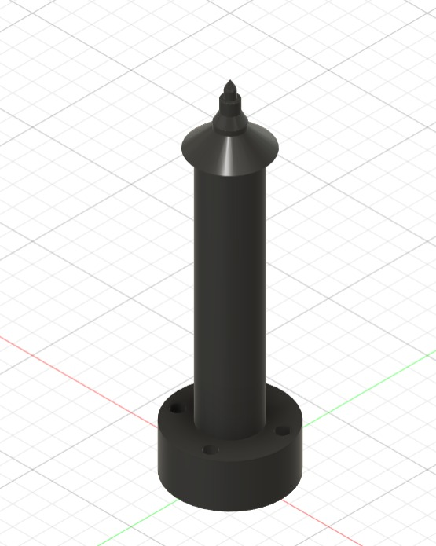
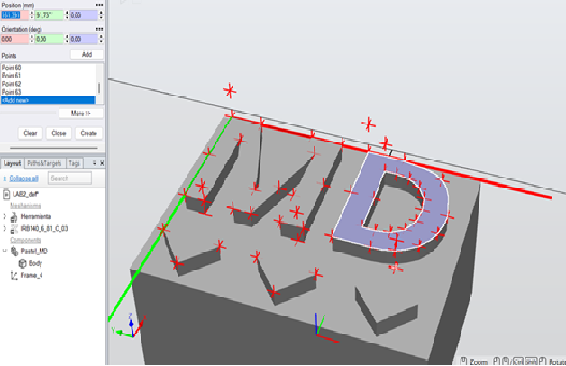
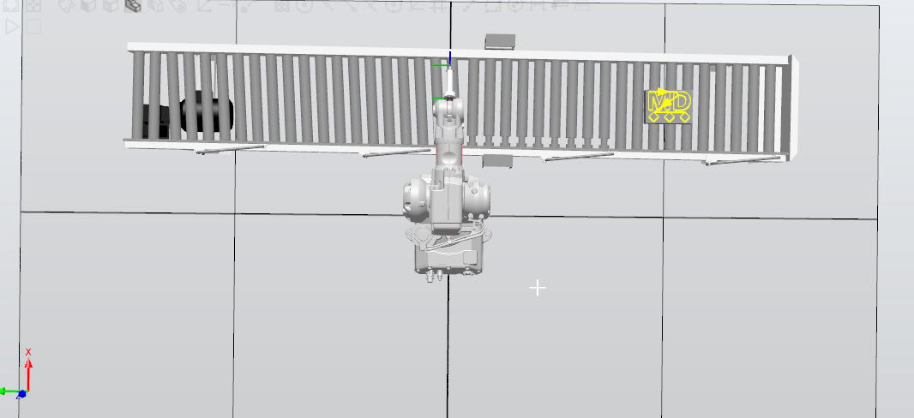
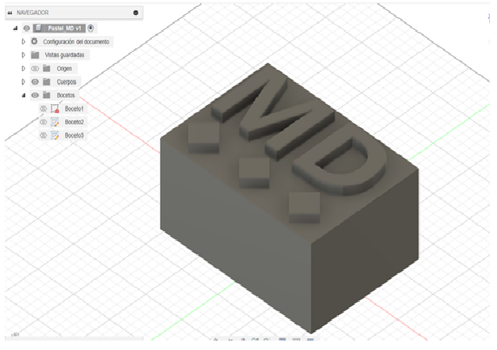
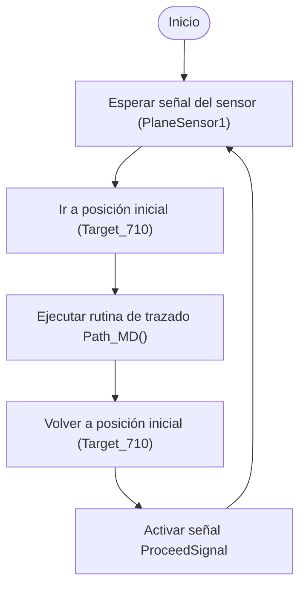

# 🎂 ABB IRB 140 - Decorador de Tortas Virtual (Lab 2 - Robótica Industrial)

Este proyecto simula una celda robotizada de decoración de pasteles utilizando un robot **ABB IRB 140**. El sistema, desarrollado en **RobotStudio** y ejecutado en robot real, traza trayectorias que forman nombres y adornos sobre una torta virtual. Para representar un entorno de producción más realista, se implementó una **línea de producción virtual** mediante **Smart Components** como `PlaneSensor`, `LinearMove` y `Source`, simulando el paso secuencial de pasteles por una banda transportadora.

---

## 📦 Requisitos

* RobotStudio (v5 o superior)
* Controlador IRC5 con módulo DSQC652
* Herramienta física (marcador montado)
* Software CAD para generar archivo `.SAT`
* Robot ABB IRB 140 y banco de trabajo
* Memoria USB y cable Ethernet RJ-45

---

## 🧁 Descripción del Laboratorio

### Objetivo

Simular la decoración de una torta para 20 personas escribiendo los **nombres de los integrantes del equipo** y una **decoración libre**, respetando restricciones de zona, velocidad y trayectoria.

### Restricciones técnicas

* Velocidades entre `v100` y `v1000`
* Tolerancia de zona: `z10`
* Movimiento continuo desde y hacia la posición `Home`
* Uso de `MoveL`, `MoveC` según la geometría
* Decoración sobre cuadrantes x(+), y(+), y su espejo x(+), y(–)
* Integración con línea de producción usando sensores y lógica de flujo de piezas

---

## ⚙️ Lógica del Sistema de Producción (Smart Components)

El sistema simula una celda con múltiples pasteles avanzando sobre una banda. Cuando un pastel llega a un punto de control (definido por un `PlaneSensor`), se detiene. En ese momento:

1. El sensor activa una señal.
2. El robot inicia la rutina `Path_MD()` sobre el objeto detectado.
3. Tras finalizar, se reactiva la cinta mediante el componente `LinearMove`.
4. El siguiente pastel es generado desde el `Source` y repite el ciclo.

A continuación se muestra el diagrama del Smart Component utilizado en la simulación:


*Figura: Diagrama completo del Smart Component. Se incluyen componentes como Timer, Source, Queue, LinearMove y PlaneSensors con lógica condicional.*

## Esta integración permite simular un entorno semiautónomo de producción por lotes.

## 🛠️ Herramienta Personalizada

Se diseñó una herramienta que permite sujetar un plumón al flanche del robot.



*Figura: Herramienta personalizada montada sobre el ABB IRB 140. Se muestran los ejes del TCP y su orientación.*



*Figura: Modelo CAD de la herramienta diseñada para sujetar un marcador. Se observan los agujeros de fijación y la forma cónica adaptada a la punta del plumón.*

---

## 🗺️ WorkObject y Escenario

Se definió un `WorkObject` con referencia al plano del pastel, permitiendo replicar las trayectorias en dos cuadrantes:

* Cuadrante principal: `x(+)`, `y(+)`
* Cuadrante reflejado: `x(+)`, `y(–)`



*Figura: Vista superior del WorkObject y letras diseñadas sobre el pastel virtual.*


*Figura: Visualización del sistema de coordenadas local del WorkObject en RobotStudio.*

---

## 🗺️ Plano de Planta

A continuación se presenta una vista desde arriba (top view) de la celda robótica. Se observan claramente el robot ABB IRB 140, el transportador, la ubicación del pastel y la orientación del sistema.


*Figura: Plano de planta de la celda. Se muestra la ubicación relativa del robot, el pastel, y el entorno de trabajo.*

---

## ✏️ Diseño de Trayectorias

Se crearon trayectorias para:

* **Nombres del equipo**: usando líneas rectas (`MoveL`)
* **Decoración libre**: combinando `MoveL` y `MoveC`


*Figura: Diseño en CAD del texto "MD" con tamaño y tipo de fuente definidos en Fusion 360.*


*Figura: Conversión de movimientos lineales a circulares en RobotStudio usando la opción "Convert to Move Circular".*


*Figura: Vista general de las trayectorias para letras y adornos con robtargets distribuidos.*

---

## 💻 Código RAPID

El siguiente fragmento muestra cómo se ejecuta la rutina desde `main()`:

```rapid
PROC main()
    WHILE TRUE DO
        WaitUntil PlaneSensor1=1;
        MoveL Target_710,v50,z0,tHerramienta\WObj:=WObj_MD;
        Path_MD;
        MoveL Target_710,v50,z0,tHerramienta\WObj:=WObj_MD;
        SetDO ProceedSignal,1;
    ENDWHILE
ENDPROC
```

La trayectoria principal `Path_MD` contiene más de 60 instrucciones `MoveL` y `MoveC` conectadas para formar figuras con continuidad.

### 🔍 Descripción de funciones RAPID utilizadas

* **`main()`**: bucle principal que espera una señal de sensor (`PlaneSensor1=1`), ejecuta la rutina `Path_MD()` y luego activa una salida para continuar la banda.
* **`Path_MD()`**: contiene la lógica de movimientos con instrucciones `MoveL` y `MoveC`.
* Se usan señales de entrada y salida (`WaitUntil`, `SetDO`) para sincronizar con la línea de producción virtual.

---

## 🔄 Diagrama de Flujo de Acciones del Robot



*Figura: Diagrama de flujo con control sobre eventos de la banda transportadora virtual.*

---

## 🧪 Resultados

* 🎥 *\[Video de la simulación en RobotStudio]*
* 🎥 *\[Video del robot real ejecutando la rutina]*
* 🎥 *\[Video de calibración de herramienta (TCP)]*

---

## 📌 Conclusiones

* Se aplicaron conceptos de espacio de trabajo, TCP y WObj para trasladar trayectorias entre cuadrantes.
* El uso de `MoveC` permitió representar geometrías curvas de forma fluida.
* La integración de sensores y flujo de objetos mediante Smart Components enriqueció la simulación industrial.
* La experiencia reforzó habilidades en CAD, simulación, programación RAPID y lógica de control de procesos.

---

## 📂 Archivos del Proyecto

El proyecto completo está organizado en las siguientes carpetas y archivos:

| Archivo/Carpeta         | Descripción                                                |
| ----------------------- | ---------------------------------------------------------- |
| `PackAndGo_Lab2.rsproj` | Proyecto completo de RobotStudio empaquetado (`Pack & Go`) |
| `Tool_CAD.SAT`          | Modelo CAD de la herramienta para sujetar marcador         |
| `WorkObject_CAD.SAT`    | Modelo CAD del WorkObject (pastel)                         |
| `videos/`               | Carpeta con videos de simulación, ejecución y calibración  |
| `imagenes/`             | Carpeta con capturas y diagramas utilizados en el informe  |
| `Module1.mod`           | Código RAPID completo usado en el robot                    |

---

## 🧠 Notas

* La parte de automatización por señales digitales fue descartada por razones de tiempo.
* Se emplearon herramientas nativas de RobotStudio, programación RAPID y Smart Components.

---

## 🔗 Referencias

* [ABB RAPID Language Manual](https://library.abb.com/)
* [RobotStudio Online Help](https://developercenter.robotstudio.com/)
* [LabSIR - Universidad Nacional](https://labsir.unal.edu.co/)

