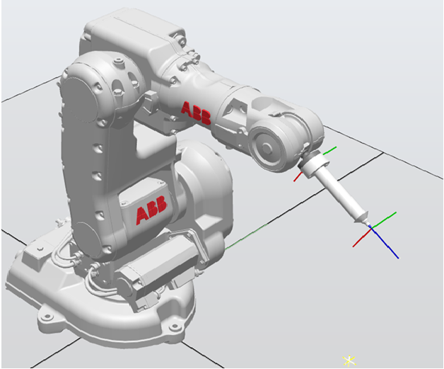
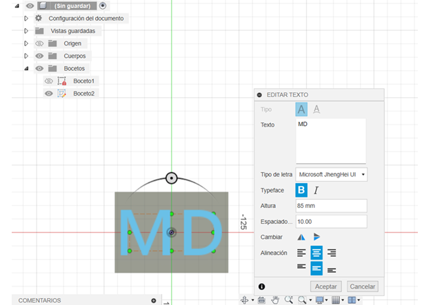
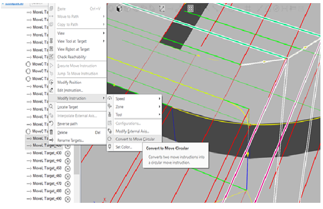

# 🎂 ABB IRB 140 - Decorador de Tortas Virtual (Lab 2 - Robótica Industrial)

Este proyecto simula una celda robotizada de decoración de pasteles utilizando un robot **ABB IRB 140**. El sistema, desarrollado en **RobotStudio** y ejecutado en robot real, traza trayectorias que forman nombres y adornos sobre una torta virtual. El enfoque está inspirado en aplicaciones industriales de decoración automatizada en panaderías.

---

## 📦 Requisitos

* RobotStudio (v5 o superior)
* Controlador IRC5 con módulo DSQC652
* Herramienta física (marcador montado)
* Software CAD para generar archivo `.SAT`
* Robot ABB IRB 140 y banco de trabajo
* Memoria USB y cable Ethernet RJ-45

---

## 🧁 Descripción del Laboratorio

### Objetivo

Simular la decoración de una torta para 20 personas escribiendo los **nombres de los integrantes del equipo** y una **decoración libre**, respetando restricciones de zona, velocidad y trayectoria.

### Restricciones técnicas

* Velocidades entre `v100` y `v1000`
* Tolerancia de zona: `z10`
* Movimiento continuo desde y hacia la posición `Home`
* Uso de `MoveL`, `MoveC` según la geometría
* Decoración sobre cuadrantes x(+), y(+), y su espejo x(+), y(–)

---

## 🛠️ Herramienta Personalizada

Se diseñó una herramienta que permite sujetar un plumón al flanche del robot.



*Figura: Herramienta personalizada montada sobre el ABB IRB 140. Se muestran los ejes del TCP y su orientación.*

---

## 🗺️ WorkObject y Escenario

Se definió un `WorkObject` con referencia al plano del pastel, permitiendo replicar las trayectorias en dos cuadrantes:

* Cuadrante principal: `x(+)`, `y(+)`
* Cuadrante reflejado: `x(+)`, `y(–)`


*Figura: Vista superior del WorkObject y letras diseñadas sobre el pastel virtual.*



*Figura: Visualización del sistema de coordenadas local del WorkObject en RobotStudio.*

---

## ✏️ Diseño de Trayectorias

Se crearon trayectorias para:

* **Nombres del equipo**: usando líneas rectas (`MoveL`)
* **Decoración libre**: combinando `MoveL` y `MoveC`



*Figura: Conversión de movimientos lineales a circulares en RobotStudio usando la opción "Convert to Move Circular".*


*Figura: Vista general de las trayectorias para letras y adornos con robtargets distribuidos.*

---

## 💻 Código RAPID

El siguiente fragmento muestra cómo se ejecuta la rutina desde `main()`:

```rapid
PROC main()
    MoveL Target_710,v50,z0,tHerramienta\WObj:=WObj_MD;
    Path_MD;
    MoveL Target_710,v50,z0,tHerramienta\WObj:=WObj_MD;
ENDPROC
```

La trayectoria principal `Path_MD` contiene más de 60 instrucciones `MoveL` y `MoveC` conectadas para formar figuras con continuidad.

---

## 🧪 Resultados
* 🎥 *Video de la simulación en RobotStudio*
  
https://github.com/user-attachments/assets/1ffb557b-989b-4899-82ca-1c4c2cbe38be

* 🎥 *Acercamiento, trayectoria en simulación*

https://github.com/user-attachments/assets/ca8687a6-68b4-4238-8379-2b3b31b9bbda

* 🎥 *Video de calibración de herramienta (TCP)*

https://github.com/user-attachments/assets/c1560678-e146-4460-b916-9dac9f8096eb
  
* 🎥 *Video del robot real ejecutando la rutina*

https://github.com/user-attachments/assets/1f7ac513-dd29-460d-893b-f6839253b33e
---

## 📌 Conclusiones

* Se aplicaron conceptos de espacio de trabajo, TCP y WObj para trasladar trayectorias entre cuadrantes.
* El uso de `MoveC` permitió representar geometrías curvas de forma fluida.
* La calibración de la herramienta fue clave para que los trazos sean coherentes en el plano.
* La experiencia reforzó habilidades en CAD, simulación y programación avanzada en RAPID.

---

## 📂 Archivos del Proyecto

| Archivo                | Descripción                               |
| ---------------------- | ----------------------------------------- |
| `LAB2_def.rspag`       | Código RAPID completo                     |
| `herramienta.SAT`      | Modelo CAD de la herramienta              |
| `img               `   | Carpeta con las imagenes del proyecto     |
| `simulation_global.mp4` | Video de la simulación                   |
| `video_ejecucion.mp4`  | Video del robot real ejecutando la rutina |
| `calib_final.mp4`      | Video de calibración del TCP              |

---

## 🧠 Notas

* La parte de automatización por señales digitales fue descartada por razones de tiempo.
* Se emplearon solo herramientas nativas de RobotStudio y programación RAPID.

---

## 🔗 Referencias

* [ABB RAPID Language Manual](https://library.abb.com/)
* [RobotStudio Online Help](https://developercenter.robotstudio.com/)
* [LabSIR - Universidad Nacional](https://labsir.unal.edu.co/)
